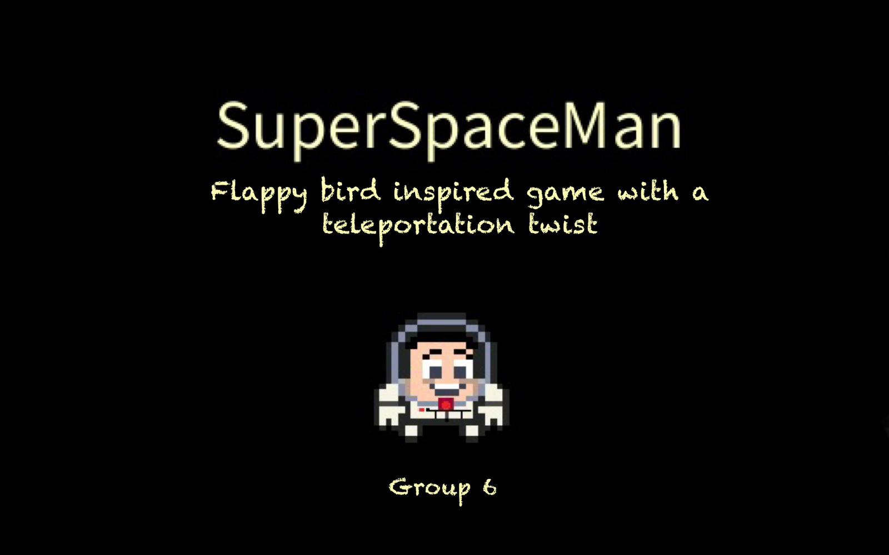
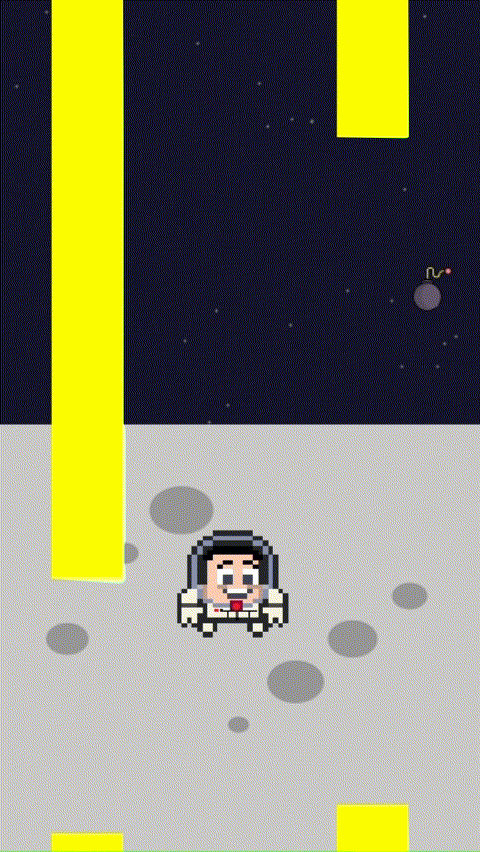
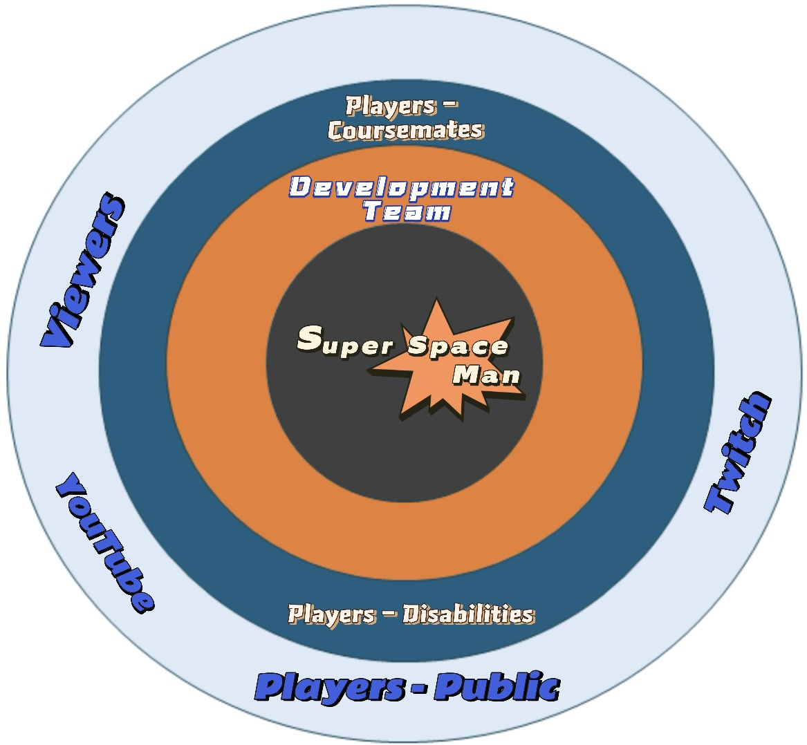
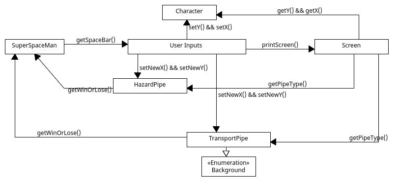
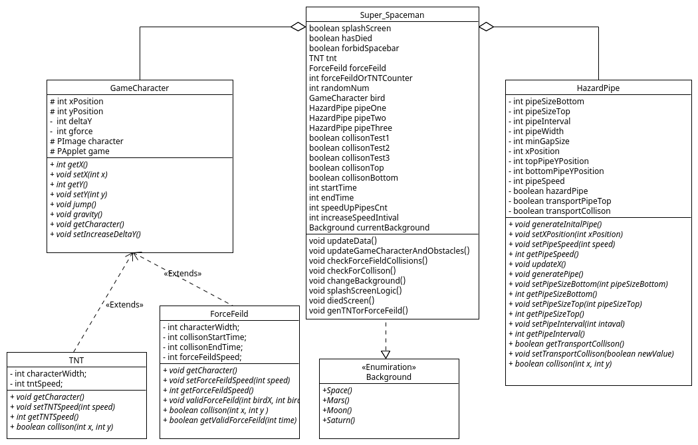
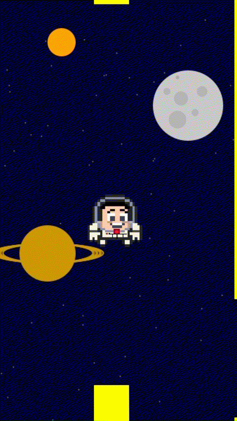
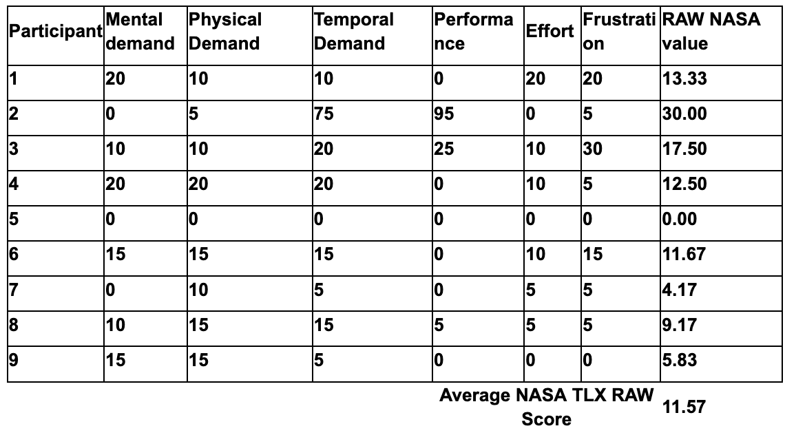
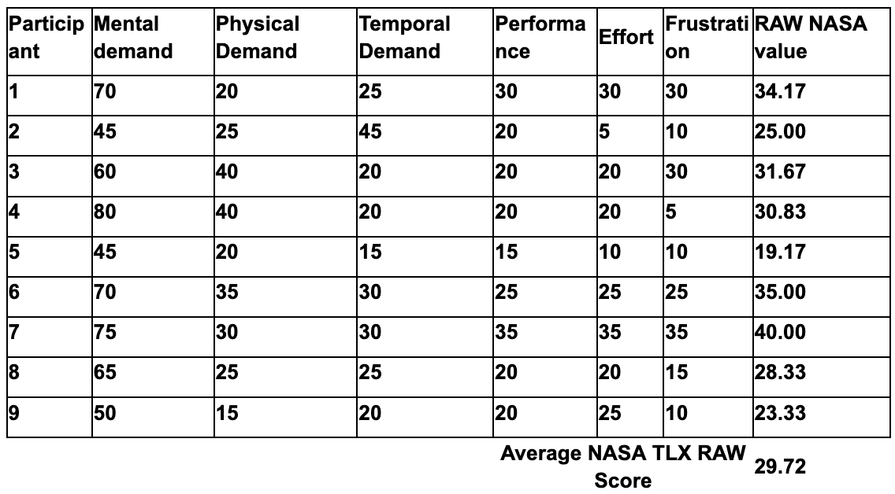
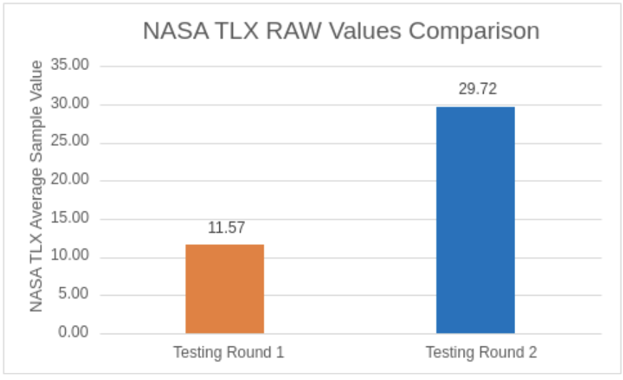
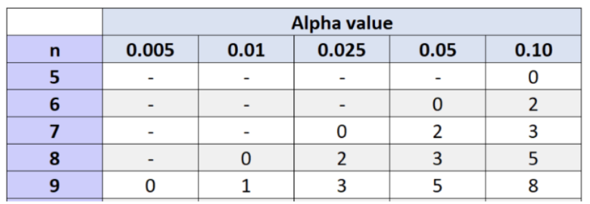

# 2024-group-6

**Table of Contents**  
- [Game Demo](#game-demo)
- [Team](#team)
- [Introduction](#introduction)
- [Requirements](#requirements)
- [Design](#design)
- [Implementation & Challenges](#implementation-and-challenges)
- [Evaluation](#evaluation)
- [Process](#process)
- [Conclusion](#conclusion)
- [Individual contribution](#individual-contribution)

 

# Game Demo

*Right-click and select "Open link in new tab" to watch the video without leaving GitHub.*

# Team 

## Team Photo

## Group Members

<table>
    <thead>
        <th>Name</th>
        <th>Email</th>
        <th>Git Hub Username</th>
    </thead>
    <tr>
        <td>James Love</td>
        <td>James.Love.2023@bristol.ac.uk</td>
        <td>@JamesLove1</td>
    </tr>
    <tr>
        <td>Cicely Marks</td>
        <td>yb19634@bristol.ac.uk</td>
        <td>@c1c3ly</td>
    </tr>
    <tr>
        <td>Max Cai</td>
        <td>rl23261@bristol.ac.uk</td>
        <td>@sparklefoa1</td>
    </tr>
    <tr>
        <td>Bohan Zhang</td>
        <td>xr23370@bristol.ac.uk</td>
        <td>@zbhbarry</td>
    </tr>
    <tr>
        <td>Qiyue Cao</td>
        <td>oz23134@bristol.ac.uk</td>
        <td>@QQiyyue</td>
    </tr>
</table>

# Introduction

Inspired by the addictive dynamics of the mobile app, Flappy Bird, “Super Spaceman” offers players a novel experience by incorporating space-themed features and enhanced control mechanics onto a desktop platform. Whilst designing our game, it was important that the game aligns closely with our initial requirements and engages the player with its features but also maintains a suitable balance between difficulty and accessibility.

As such, we have introduced three new features that make our game innovative and novel: 

The addition of hazards such as TNT, which upon contact, immediately kills the player. This will increase the level of difficulty, ensuring our game has a suitable level of workload in order to remain engaging.

**Figure 1 - Demonstration of TNT Hazard**

<figure>
  
</figure>

The inclusion of interactive game props capable of destroying hazards, as well as a protective force field shield that grants the player immunity. This feature is highly interactive and aims to engage the player with strategic thinking. 

**Figure 2 - Demonstration of Force Field**
<figure>
  
</figure>

The final feature introduces innovative patterns that allow the player to navigate through transport pipes to reach new locations and avoid upcoming hazards. This adds a captivating visual element to the game, and again encourages the user to use strategic thinking.

**Figure 3 - Demonstration of Teleportation**
<figure>
  
</figure>

We knew that our game would evolve as we created and have therefore decided to follow an Agile workflow. This enabled our team to remain flexible and improve our game in response to regular testing.

# Requirements

**Early Stages Design & Ideation Process**

To begin our ideation process, our team played and discussed several favourite computer games, creating a shortlist of seven. After brainstorming feature ideas, how we could implement them and user appeal, we narrowed our focus to two games: Flappy Bird and Snake. This open discussion was essential in shaping our direction. We then created paper prototypes of novel ideas based on these games, allowing us to visualise the product concept and requirements of our games. 

**Figure 4 - Early Game Ideas**
Key:
1-9 : Top Options
M: Maybe
N: Removed From List
| Name | URL | Sutibility / Intrest / Ranking|
| -------- | -------- | -------- |
 Snake| <https://en.wikipedia.org/wiki/Snake_(video_game_genre)>   | 1|
| Flappy Bird| <https://en.wikipedia.org/wiki/Flappy_Bird>  | 2a|
| Tetris| <https://en.wikipedia.org/wiki/Tetris>  | 2b |
| Angry Birds| <https://en.wikipedia.org/wiki/Angry_Birds_(video_game)>  | 3 |
| Kingdom Rush| <https://en.wikipedia.org/wiki/Kingdom_Rush>  | M |
| Super Mario| <https://en.wikipedia.org/wiki/Super_Mario_Bros>.  | M |
| Brick Breaker| <https://en.wikipedia.org/wiki/Brick_Breaker>   | M |
| Bejeweled| <https://en.wikipedia.org/wiki/Bejeweled>  | N |
| Zuma| <https://en.wikipedia.org/wiki/Zuma_(video_game)>  | N |
| Deemo| <https://en.wikipedia.org/wiki/Deemo>  | N |

### Figure 5 - SnakeWars Prototype

*Right-click and select "Open link in new tab" to watch the video without leaving GitHub.*

Snake is a game that each of our team members had enjoyed playing and we all agreed that it could be a good game to extend. However, following our development process, and displaying our paper prototype to other class members, we concluded that we did not want to take the idea of ‘Snake Wars’ any further. Our feedback from class members was generally neutral, but lacking excitement. Despite discussing a few ideas on how to extend the game, it felt restricted, and the ideas did not flow as easily as in our discussion on our second game idea.

Although both games hold potential, our ideation process showed that Flappy Bird, i.e. ‘Super Spaceman’ had a greater scope for features, creative opportunities and user appeal.

### Figure 6 - Super Spaceman Prototype
<!-- check to see if link works at a latter date https://img.youtube.com/vi/6UDCoNbmHIw/maxresdefault.jpg -->

*Right-click and select "Open link in new tab" to watch the video without leaving GitHub.*

For Super Spaceman, we were able to think of multiple categories, including various different hazards and power ups (as demonstrated in the above prototype). When researching these features, we concluded that Super Spaceman would also be more complex to implement, therefore providing us a greater chance to apply our knowledge and skills. Similarly, we felt more excited about creating detailed graphics for the interface for Super Spaceman. Our thoughts were validated in Monday’s lab, where our paper prototype for Super Spaceman received overwhelmingly positive feedback. There was a consensus that this was the more innovative concept and the most promising in terms of popularity. Creating the paper prototype played an important role in this decision. The tangible visualisation demonstrated the game’s potential and helped us to decide on our game features.

# Use Case Diagram & User Specifications

We then created a Use Case diagram and Specification. This demonstrated the logic and flow of our game and helped us identify the functional requirements of Super Spaceman, and what we would need to implement to achieve these requirements. 

**Figure 7 - Usecase Diagram**

**Figure 8 - Usecase Specification - General Player**
<table>
    <tbody>
        <tr>
            <td><b>Basic Flow</b></td>
            <td></td>
        </tr>
        <tr>
            <td>1.</td>
            <td>Player uses the the right key on the mouse to make Super Spaceman move up defying gravity. </td>
        </tr>
        <tr>
            <td>2.</td>
            <td>Super Spaceman trys to avoid all hazards.</td>
        </tr>
        <tr>
            <td>3.</td>
            <td>When Super Spaceman eventually hits a hazard, the score is placed on the screen in terms of time.  </td>
        </tr>
    </tbody>
</table>

<b>Alternative Flow:</b>
<table>
    <tbody>
        <tr>
            <td>Steps:</td>
            <td>Pipes</td>
            <td>Power Up's (Invinsibility)</td>
            <td>Hazards (Nuclear Bombs)</td>
        </tr>
        <tr>
            <td>Description:</td>
            <td>Going down pipes transports Super Spaceman to a new map</td>
            <td>Power ups give Super Spaceman extra powers</td>
            <td>When Super Spaceman comes into contact with a Hazard, he dies</td>
        </tr>
        <tr>
            <td>1.</td>
            <td>Player uses the the right key on the mouse to make Super Spaceman move up, defying gravity.</td>
            <td>Player uses the the right key on the mouse to make Super Spaceman move up defying gravity.</td>
            <td>Player uses the the right key on the mouse to make Super Spaceman move up defying gravity.</td>
        </tr>
        <tr>
            <td>2.</td>
            <td>Player guides Super Spaceman into the pipes. Super Spaceman is transported to a new map, or new place on the current map.</td>
            <td>Super Spaceman comes into contact with the Power Up</td>
            <td>Super Spaceman comes into contact with the Hazard</td>
        </tr>
        <tr>
            <td>3.</td>
            <td>Super Spaceman eventually hits a hazard. The score is then placed on the screen in terms of time.</td>
            <td>The Space bar is used to activate the power up.</td>
            <td>When Super Spaceman dies, the score is then placed on the screen in terms of time.</td>
        </tr>
        <tr>
            <td>4.</td>
            <td></td>
            <td>Super Spaceman eventually hits a hazard. The score is then placed on the screen in terms of time.</td>
            <td></td>
        </tr>
    </tbody>
</table>

As seen in Figure 9, we also identified our stakeholders and created user-stories using the Onion Model. This helped identify our stakeholders' relation to the game, as well as visualise their various layers of involvement. 

**Figure 9 - Onion Model**

**Figure 10 - Stake Holders Table**

<table>
    <thead>
        <tr>
            <th>Stake Holder</td>
            <th>Notes</td>
        </tr>
    </thead>
    <tbody>
        <tr>
            <td>Development Team</td>
            <td>N/A</td>
        </tr>
        <tr>
            <td>Viewers</td>
            <td>People watch live game play e.g. on Youtube, Twitch or over a friends shoulder</td>
        </tr>
        <tr>
            <td>Player - Coursemates</td>
            <td>A player base familiar with the project requirements and can peer review our work.</td>
        </tr>
        <tr>
            <td>Player - General Public</td>
            <td>N/A</td>
        </tr>
        <tr>
            <td>Player - Disabilities (Colour Blind) </td>
            <td>Users with colour blindness should be able to use the app</td>
        </tr>
        <tr>
            <td>Markers</td>
            <td>Looking to play the app to mark our work within 5 mins</td>
        </tr>
    </tbody>
</table>

**Figure 11 - User-Stories**
>
>"As a Player from General Public I want to play a game based on flappy birds with new innovative features so that it grabs my intrigue and attention."

>"As a member of the Development Team I want to implement a first in class app/game that push me to learn new skills."

>"As a Viewer I want to watch a game to learn by watching players that are more skilled than myself so that I can improve my game play."

>"As a Coursemate playing another groups game, I want to learn off them and become inspired by their vision and implementations of their app/game."

>"As a Player with a disability such as being colour blind I find it very difficult to play some games that dont cater to this. I would like a game which caters to my needs of having different colour contrasts so that i am not impared by my lack vision."

>"As a Marker I want to quickly assess the assignment that I am marking by playing the game within 5 mins."

>"As a Player from the general public, I want to explore different maps/scenarios in the game, so that I can experience freshness and novelty."

>"As a Viewer, I want to see changes in the speed of the game process,  as this is what captures my attention."

## Requirements
Using user stories and use-case diagrams helped our team identify our top-level user needs. This gave us a clear understanding of what is needed of our game. Whilst also highlighted some additional things to consider. 

<ul>
    <li>Our game should provide a fun and engaging experience to users, which will be measured against our Heuristic Evaluation, aiming to achieve a score below 2 for each Heuristic.</li>
    <li>There should be a suitable balance between demand and playability - The average RAW TLX score of our testing participants should be above 25 to achieve a “medium” workload according to researchers NASA interpretation (Rubio et al, 2004).</li>
    <li>It should be inspired by Flappy Birds, but include at least 3 innovative and bug-free features that are not present in the original game. Each feature will pass manual testing before the game is released.</li>
    <li>Our game should challenge us as software engineers, and provide us with new skills. Each member will be able to identify at least one new technical skill by the end of the project.</li>
    <li>Our game should be clear and concise, where all features can be demonstrated within 1-2 minutes of gameplay, which will be assessed by the marker.</li>
    <li>Our game should be accessible to all players, and include adaptability features that cater to those with disabilities.</li>
</ul>

Creating requirements also highlighted just how important it is to consider all potential players, as well as clearly understanding every player’s needs. We discussed specific ways to ensure that our game resonates with many, but also analysed our requirements and acknowledged that there could be conflicts between our requirements. For example, including exciting and sophisticated features that can clearly be demonstrated to a marker within 5 minutes. We also acknowledged that it may be unrealistic to implement all of our requirements, particularly the adaptability features, within our project time frame.
The Elicitation Techniques used proved to be an effective planning tool. They helped us as a team decide what exactly to develop, providing us with clear requirements and a precise acceptance criteria. 

# Design

**Original Class Diagram**  
In the original design, the SuperSpaceMan class acts like the spinal cord for the game logic. As such all other classes ultimately link back to this one class.  The class sets three variables: time, winOrLose and startGame. As well as stores methods and logic for the gameLoop() getWinOrLose(), StartGame() and getTime(). The UserInput and Screen classes are used to record input from the user and display the gameplay to the user. E.g. when the user presses the spacebar this will be recorded in the UserInput class and displayed using the Screen class. The Character class is used to store and control the data of the player's character. This includes the character screen x and y position. The HazardPipe and TransportPipe are used to display game objects that the user will have to interact with. As the two classes are quite similar they will take a lot of their methods and attributes from Abstract classes. The big difference between the two classes is that the hazard pipes kill the player while the transport pipes transport the player to a new map. 

**Figure 12 - Original Class Diagram**

Communication Diagram
The SuperSpaceMan Class interacts with the UserInputs Class through the getSpaceBar() method, which can be used to monitor whether users press the spacebar key to move. The UserInputs Class also manages the character's interactions with the obstacles through the setNewX() and setNewY() methods, which shows the new character's position on the screen.

The Screen Class is used to show the game state on the screen through the printScreen() method that includes the characters, backgrounds, obstacles etc. In addition, the UserInput Class interacts with the Hazard Pipeline and Transport Pipeline classes, implementing the setNewX() and setNewY() methods. These interactions transport characters to new locations and move game obstacles.

When the Screen interacts with the pipe, we use the getpipetype() method to return the pipe type. If TransportPipe is returned, SuperSpaceMan is transported to a new map. However, if HazardPipe is returned, it is game over for the player. The getwinorlose() method can obtain the win-or-lose status of the game.

**Figure 13 -Communication Diagram**

**Class Diagrams - Delegating Tasks**

Our conceptual ideology surrounding our code development consisted of many abstractions. This was so we could simplify our code development process and delegate amongst team members. The class diagram design process sparked many conversations and ideas of how best to lay out and delegate workload. However, as always no plan survives first contact with the enemy. Or in this instance, our initial drafts! 

**Figure 14 - Updated Class Diagram**

**Why did we update our Class Diagram?**

Upon starting to code we realised that we had made major errors in our Class diagram. This was due to our understanding of the Processing library. We quickly found that many abstractions in the Processing library made a lot of our classes redundant or unnecessary. As such we deployed an agile swift movement away from our original diagram. Most notably we had to scrap the UserInputs, Screen, Hazard, Pipe, and TransportPipe classes. This was followed by a big refactor and change of scope of the SuperSpaceMan and Hazardpipe Classes. We had to include much of the Processing logic within the SuperSpaceMan class e.g. Draw(), and KeyPressed() methods etc. Along with the removal of the Hazard, and Pipe classes as Processing does not have a way to deal with Abstract and Interfaces classes. As a result of this, we combined the HazardPipe and TransportPipe classes into one class called HazardPipe. Thankfully Processing was able to support Extend and Enumeration classes which simplified our game development for the Background, TNT and Forcefield classes. 

The ForceField Class which extends from the GameCharacter class adds extra functionality by adding methods such as setTNTSpeed(), getTNTSpeed(), and collisions(). The collision() method is particularly important as it detects whether the player has collided with a forcefield. 
Whilst the TNT Class provides an obstacle for the users. It has a collision method, which detects whether the user has knocked the game character (SuperSpaceMan) into a TNT object. Upon impact, the game ends as the user's game character has died.

Our new and improved HazardPipe class now contains logic for what was the old HazardPipe and TransportPipe classes. This meant we had to combine the two classes' functionality. In terms of gameplay, HazardPipes are to be avoided at all costs whilst TransportPipes transport a player to a new map.  To do this we had to randomly generate the length of the pipes as well as the type of pipes.  This presented a new and interesting challenge when creating the collision logic as it had to be able to handle two different types of pipes within one method. 

# Implementation and Challenges

When planning our game, we identified three areas of challenge:
<ol>
    <li>Using generative level design to create the pipes
</li>
    <li>Optimisation of backgrounds to ensure smooth gameplay  
</li>
    <li>Creating reliable collision detection 
</li>

</ol>

**Challenge 1: Using generative level design to create randomly generated pipes**  
The core of our game lies around our hazard and transport pipes, which generate pairs of pipes with a randomly generated space between them, meaning the pipes always have different positions along the X-axis. A random number is generated upon calling generateInitalPipe() to determine whether the pipes are transport pipes. Initially, we considered a separate class for this. However, we decided that it was more efficient to integrate it into the HazardPipe class, as it would avoid stray addresses, therefore, reducing the complexity of object management and null pointers.

We used the updateX() method to update the position of pipes every time the draw() method was called. Once the pipe goes beyond the edge of the screen, a new pair is generated.  

Collision logic is used to determine whether the character has bumped into the pipes or not. Upon impact, the logic controls whether the player has died(Impact with Hazard Pipe) or transports to a new map(Contact with Transport Pipe). 

Throughout the game, we use getter and setter methods to update the gameSpeed variable. This variable is used by updateX() to move the pipe a set number of pixels every time draw() is called. This increases the speed of the pipes, and therefore the game difficulty. 

**Figure 15 - Demonstration of Pipes**
<figure>
  
</figure>

**Challenge 2: Optimisation of backgrounds to ensure smooth gameplay between the multiple backgrounds**  
To create the different backgrounds, we used a ‘Background’ enum to define space-themed backgrounds: Space, Mars, Moon and Saturn. Each background has its own drawing method ‘drawBackground(PApplet app)’, that contains helper methods such as ‘drawCraters’, ‘drawMountains’ and ‘drawBoulders’, and utilises Processing’s drawing functions to render the background onto the canvas. Colours are set using the RGB colour values.

The first issue we encountered was how the background reacted with the rest of the game code, such as the pipes and character. Throughout the coding process, there were times where we made changes to the background, only for it to affect other parts of the game, like distorting the pipes, or creating a lag in the character. After adjusting sizes and method calls within the code, this challenge was overcome. The changeBackground method in the Super_Spaceman class, holds the primary logic for changing the background, and uses ‘Math.random()’ to generate a number between 0.0 and 1.0. Each background is assigned a third of this range, and depending on what number is generated, determines the background based on the random number. This ensures the generated background is random. The method then calls the setup() method, to reset the game logic.

Another issue was the background’s interaction with the pipe logic, which was supposed to change only when the character travelled through a transport pipe. Initially, this was unpredictable and the background changed only occasionally. We then realised the changeBackground() method was not being called at all appropriate moments. 

**Figure 16 - Demonstration of Teleportation**
<figure>
  
</figure>

**Challenge 3: Creating reliable collision logic that detects hazards and power up appropriately**  
Our first challenge was to tackle the random generation of these elements. We achieved this using methods that generate random numbers and are then used to generate the y-Coordinate for the TNT/ForceField. With each loop within the draw function, the x-position is decreased to move the elements across the screen. 

The next issue we found was ensuring the correct response when the character interacted with the TNT or ForceField. We used collision logic to detect this. Upon collision with TNT, the collision returns true and the character dies. When the character collides with the forcefield, further collisions return false for a set time. This logic allows the correct game flow.

Another issue involved the interaction between TNT/ForceFields, and the change in gamespeed. Initially, when the speed increased, the TNT and ForceField did not match the Pipes. Further issues involved some of the TNT or ForceFields elements moving at the same pace and some not. This challenge was overcome when we introduced the speed variable, which was passed to our TNT/ForceField classes, enabling the speed of the TNT/ForceFields to match that of the pipes. 

**Figure 17 - Demonstration of Force Field**
<figure>
  
</figure>

# Evaluation
During the development process, it was important to understand whether SuperSpaceMan had a suitable balance between demand and playability, in order to meet our requirements. In our literature review, we found that in video game development, the integration of mixed research methods effectively analyses game difficulty as well as enhances player experience (Romero-Mendez et al., 2023). Therefore, we utilised quantitative and qualitative testing to evaluate our game: Heuristic evaluation and NASA TLX; - effectively combining objective metrics, as well as a detailed player experience. 

There were two stages of testing. The first occurred prior to our first sprint, when few of our difficulty features had been implemented. We then repeated the testing, (after we had implemented our TNT and increased game speed feature) using the same 9 participants, after sprint 2, and compared the results. The results identified the final adjustments to be made in sprint 3. 

**Figure 18 - Demonstration of Speed Increase**
<figure>
  
</figure>

**Figure 19 - Demonstration of TNT Hazard**
<figure>
  
</figure>

## Qualitative Evaluation

### Heuristic Evaluation 

Heuristic evaluation is a usability method used to review a game based on established usability principles. The evaluation method focuses on all aspects of our game (as shown in Figure 20), whilst also focusing on specific features, to ensure it is engaging and accessible to all players (Paavilainen et al., 2018). 

The evaluation identified severe issues with our character interface, particularly the need for excessive clicking to make the character jump higher. This caused frustrating gameplay (4), identifying the need to increase the height of the jump per click. Testing also illuminated issues relating to the Movements and Pipes interface. For example, a greater distance between pipes, and pipes not generated randomly. Although the issues individually seem minor, accumulated they are noticeably persistent (3), adversely affecting the gameplay experience. 

Based on the feedback, we adjusted the logic to increase the character’s jump height, as well as introducing the spacebar as an alternative control. Additionally, we refined our pipe logic, adding a method to randomly generate pipes, and decrease the spacing between them. These improvements were corroborated in our second heuristic evaluation, where the frequency of both of our previous scores reduced from 4 to 0. These improvements positively impacted the usability of our game.

**Figure 20 - Heuristic Results - Testing Round 1**
<table>
    <tbody>
        <tr>
            <td><b>Interface</b></td>
            <td><b>Issue</b></td>
            <td><b>Heuristic(s)</b></td>
            <td><b>Frequency</b> 0 (rare) to 4 (common)</td>
            <td><b>Impact</b> 0 (easy) to difficult (4)</td>
            <td><b>Persistence</b> 0 (once) to 4 (repeated)</td>
            <td><b>Severity</b> = Sum Total of F+I+P/3</td>
        </tr>
        <tr>
            <td>Pipes</td>
            <td>pay attention to the spacing between the pipes(at least could be able to see the next pipe when passing through this pipe)</td>
            <td>Aesthetic and Minimalist Design</td>
            <td>4</td>
            <td>1</td>
            <td>4</td>
            <td>3</td>
        </tr>
        <tr>
            <td>Character</td>
            <td>Need bigger jumps(need to click many times to jump higher)</td>
            <td>Consistency and Standards</td>
            <td>4</td>
            <td>0</td>
            <td>0</td>
            <td>1.3</td>
        </tr>
        <tr>
            <td>Gravity</td>
            <td>Fall too slowly. Character need more Gravity</td>
            <td>Consistency and Standards</td>
            <td>0</td>
            <td>0</td>
            <td>0</td>
            <td>0</td>
        </tr>
        <tr>
            <td>Movements</td>
            <td>Gameplay judgments are a bit sketchy, the distances of pipes are a bit large. Reset the judgments of collision, narrowing the distances of pipes</td>
            <td>Consistency and Standards</td>
            <td>4</td>
            <td>2</td>
            <td>4</td>
            <td>3.3</td>
        </tr>
    </tbody>
</table>
 

**Figure 21 - Heuristic Results - Testing Round 2**

<table>
    <tbody>
        <tr>
            <td><b>Interface</b></td>
            <td><b>Issue</b></td>
            <td><b>Heuristic(s)</b></td>
            <td><b>Frequency</b> 0 (rare) to 4 (common)</td>
            <td><b>Impact</b> 0 (easy) to difficult (4)</td>
            <td><b>Persistence</b> 0 (once) to 4 (repeated)</td>
            <td><b>Severity</b> = Sum Total of F+I+P/3</td>
        </tr>
        <tr>
            <td>Bomb</td>
            <td>Sometimes, randomly generated bombs appear on the essential path leading to the next exit, making it unavoidable and causing the player to fail</td>
            <td>Error prevention</td>
            <td>1</td>
            <td>4</td>
            <td>4</td>
            <td>3</td>
        </tr>
        <tr>
            <td>Shield</td>
            <td>The randomly generated shield quickly expires and disappears before you have a chance to use it</td>
            <td>Error prevention</td>
            <td>4</td>
            <td>4</td>
            <td>4</td>
            <td>4</td>
        </tr>
        <tr>
            <td>Transport pipes</td>
            <td>The transport pipes are difficult to activate, only changing the background in rare cases. Once the background has changed, entering the transport pipe again will not trigger another background change</td>
            <td>Error prevention</td>
            <td>4</td>
            <td>4</td>
            <td>4</td>
            <td>4</td>
        </tr>
        <tr>
            <td>Hazard pipes</td>
            <td>After collision with the bottom pipe, the player can continue to jump and proceed with the game'This issue can be resolved by disabling the keyboard input'</td>
            <td>Error prevention</td>
            <td>4</td>
            <td>1</td>
            <td>4</td>
            <td>3</td>
        </tr>
         <tr>
            <td>Background</td>
            <td>The number of stars in the background and their frequency of blinking is too high, which may cause discomfort for some players</td>
            <td>Aesthetic and Minimalist Design</td>
            <td>1</td>
            <td>1</td>
            <td>4</td>
            <td>2</td>
        </tr>
    </tbody>
</table>

Our second testing illuminated new issues relating to Error Prevention and Aesthetic Design. Noticeably, an issue with the shield powerup, which disappeared too quickly, receiving a frequency score of 4. Similarly, the new transport pipes activated inconsistently, again, scoring 4. A more minor issue involved the background stars blinking excessively, potentially causing discomfort to some players. These findings have directed our priorities for the final sprint, in order to enhance the overall game experience.

### Summary - Qualitative Evaluation

The Heuristic Evaluation bought important issues about our game, to our attention. The issues primarily related to Consistency and Standards, but also the Aesthetic and Design of our game. The most severe issue related to our character interface. We found that the user needs to click many times to make the character jump higher, leading to a frustrating gameplay. This was a common issue, scoring 4/4 and led to a sum total of 4/4. We have decided to modify the character slightly, and increase the height of the jump per click. We have also decided to increase the gravity rate. This is because we found that the character fell too slowly, making it difficult to progress further through the game.

We noted issues relating to the Movements and Pipes interfaces of our game. This included the distances between pipes being too large, the pipes not generating randomly and the character falling off the screen. Although the issues individually are relatively minor, accumulated together they are noticeably persistent and severe (3/4), and overall leads to a rather ‘sketchy’ gameplay. Therefore, we have decided to reset the judgements of collision, narrow the distance between pipes and ensure that the pipes pattern does not continuously repeat. This not only improves the Consistency and Standards usability, but also the Aesthetic and Minimalist Design usability.

## Quantitative Evaluation

**NASA TLX**

We used NASA Task Load Index (TLX), finding the RAW NASA TLX score to assess the user experience. This provided a quantitative insight into the user interaction, as well as indicating the overall performance of our game (Paavilainen et al., 2018). 

**Figure 22 - NASA TLX - Testing Round 1**

Shown in Figure 22, the first NASA questionnaire indicated that our game was not demanding, with low scores on mental, physical and temporal subscales. Scores ranged from 5 to 20, with Participant 5 scoring as low as 0 for all demand subscales. These results point to a low workload, which is surprising given that many participants struggled to get far into the game, rarely advancing past the third pipe. Nevertheless, the data highlights an improvement area and we plan to increase the game’s demand, whilst maintaining system simplicity. 

One result in particular stands out. Participant 2 scored temporal demand high (75). The reason for this is unclear and compared with the rest of the data is an anomaly. The participant potentially misunderstood the scale, or there was a data collection error. This seems plausible considering the participant scored the mental and physical demand at 0 and 5.

**Figure 23 - NASA TLX - Testing Round 2**

As seen in Figure 23, our second set of quantitative testing showed a significant improvement to our game demand. The improvement can primarily be seen in mental demand, with the highest score being 80 and the lowest now 45. These results corroborate that our new features: the TNT hazard and the increased speed, have optimised the game difficulty. Our average NASA TLX RAW Score (29.72), proves that our game achieves a “medium workload” (Rubio et al, 2004), meeting our requirement that the game should have a suitable balance between demand and playability.

**Figure 25 - NASA TLX Comparison**

Comparing our results using the Wilcoxon Signed Rank Test further corroborates this. As shown in Figure 24, using an alpha value of 0.05, our W test statistic was 1, meaning it was considerably below the needed 5 to be significantly different. The practical application of NASA TLX has been highly valuable in managing the demand and playability of Super Spaceman. It has given us a greater understanding of our game from the player’s perspective, helping us to assess what adjustments needed to be made. It was ultimately a highly effective way of measuring the subjective perceived workload (Rubio et al, 2004).

**Figure 24 - Wilcoxon Results** 
W test statistic = 1 
Number of non-tied pairs (n) = 9

**How was our code tested?**

Our code underwent manual testing, which involved identifying the issue, locating the relevant code, printing the output and adjusting the logic accordingly. This structural approach ensured targeted and focused testing (Sharaievskyi et al., 2024).

We resolved issues such as incorrect acceleration settings. When adding speed settings to the pipe, it failed to generate cyclically and disappeared. Similarly, the force field and TNT did not adjust to the speed changes.

We inserted print statements to the Hazard Pipes class to output current speed and the x-axis positions of generated pipes. This pinpointed the error in the judgement condition in updateX() method. Each time the x-axis position decreased, the value gradually increased, and was not equal to the negative pipe width. By modifying it to be less than or equal to the negative pipe width, we resolved the issue, similarly resolving issues with the force field and TNT.

# Process
As a team, we decided on a working practice that covered all elements of our project, using a variety of techniques to ensure we as a team worked in the most efficient and productive way possible.  

**Scrum** 
As a Team, we created and maintained a manual Kanban board on our README.md. This enabled all teammates to have full visibility of the project at all times. Team members would create new branches to work on a particular feature and then merge it back into the dev branch. If there was a particular item of work outstanding the Kanban board would not be updated. Upon merging into Main it would become highly apparent and would be top of mind to prioritise the completion of this work the following week. 

**Git** 
As a Team we used GitHub as our Git Forge of choice. Each week/Sprint we started a new Dev branch to maintain and organise the code. The work from the following week would be peer reviewed and then pushed to main. This enabled us to protect the Main branch from becoming non-operational. We would use our local repos to develop the code and would merge and test the code before submitting a pull request to Main.

**Team Meetings**  
Team Meetings were a regular feature of our working practice. We consistently met Monday afternoons to discuss the plan for that week, reinforcing our commitment to working in line with an Agile methodology. Weekly team meetings were used to discuss ideas, delegate tasks and help team members with any issues. They were also used to reflect on our achievements from the previous week, ensuring every member was up-to-date. Face-to-face meetings were particularly invaluable when addressing technical issues, for example, helping each other setup computer development environments - a task that is often difficult to solve remotely. They were also useful when discussing our use case diagrams, as we found it difficult to explain over the phone, specific things that we wanted changing and why. We had realised that our initial plan was perhaps over complicated and we had some minor issues when defining whether something was an ‘include’ or ‘extend’. Ultimately, discussing and explaining in person solved this issue, as we were able to explicitly point out what needed to be changed.

**Team Communication** 
Effective communication was pivotal to achieving our goals. We used a group chat hosted on WhatsApp, which enabled us to share files and take video calls to discuss ideas. We would post information about where we were going to meet for our weekly meeting. Without this method of communication, it would have been much more difficult to coordinate this. Video calls and voice calls became very useful over the sprints as we were not all necessarily geographically in the same city. 

**Design** 
When designing our game we used a variety of methods. The main ways that we used were Paper Prototyping and UMLetino tool to draw Class Diagrams and Communication Diagrams. As a team we found that creating the first prototypes using paper was highly effective and allowed us to quickly, and cheaply, reiterate our designs. They facilitated team engagement allowing us to visualise our ideas, helping to reach a consensus. 

**Development & Testing** 
We took advantage of a range of technical tools to help in development and testing. This included using Processing plugins, Live Share along with Microsoft(MS) Excel and Google Sheets for testing. We decided that it was best to use VScode as we could leverage the power of the IDE alongside the plugins. The Processing plugins allowed us to run the game from within VScodes terminal whilst Live Share enabled us to screen share. Live Share was particularly useful during the sprints as we could help one another debug and merge files while geographically being in two very distinctly different places. When it came to testing we leveraged MS Excel to collect testing data from participants. This was useful as, as a team, we could share and record the data quickly - collect HCI Evaluation data.

# Conclusion
Our journey developing Super Spaceman has been invaluable, and we have certainly learnt a lot. Our effective teamwork and strategic planning have ensured that Super Spaceman has successfully achieved almost all of our requirements. Throughout the project, we learnt about the role of Git, which was essential for organising our code and collaborating. Initially, we had issues with Git, where merging different workflows led to conflicts. However, as time went on, each team member became more comfortable using it. We also developed a systematic approach where we agreed to do one pull request into the protected main branch every Sunday. This kept our code organised and gave us a consistent goal to work towards.

Developing Super Spaceman also gave us valuable experience in object-oriented design, which underpins the architecture of our game. By extending the GameCharacter class, we were able to implement hazards and power-ups and have them inherit all methods from GameCharacter, without having to create entire new classes. Object Oriented design is widely used and this assignment was great practice for future work.

We collectively committed to using an agile workflow. This was the ideal approach for our team, as we knew that our ideas would change and develop throughout the development process. In response to testing, we found that our first game prototype was too easy. The Agile method taught us to be responsive to change, and as such we were able to add in features to make our game more challenging, including features such as the increase in speed, which was not even in our initial game design. This is also evident in our communication and class diagrams, which had to be consequently modified. The approach taught us the importance of being adaptive. Ideas and processes can change quickly depending on the previous week’s productivity, and there were times where we did not achieve our plans, so plans for the following week would have to be updated. 
 
Our game development journey has not been entirely smooth and we have had issues with our communication as a team. We learnt that we should have delegated work early on. Unexpectedly two of our members were not able to contribute throughout the three sprints, meaning others had to take on a greater workload, to avoid falling behind. We had a significantly reduced capacity, and as such, were not able to meet our final requirement. We had hoped to implement features to ensure our game was accessible to those who are visually impaired or colourblind. If we had delegated specific tasks from the beginning, members could have planned to complete the tasks outside of the sprints. 

There are certainly exciting directions to take Super Spaceman in. Looking forward, we plan to introduce a coin feature which increases your score and unlocks additional maps, allowing the player to progress throughout the game. The coins would also allow for the user to unlock other power ups. This would add an engaging and dynamic storyline aspect into the game. A timer and leaderboard would also be necessary to facilitate this future development.

# Individual contribution
"DO NOT WRITE ANYTHING HERE YET"

