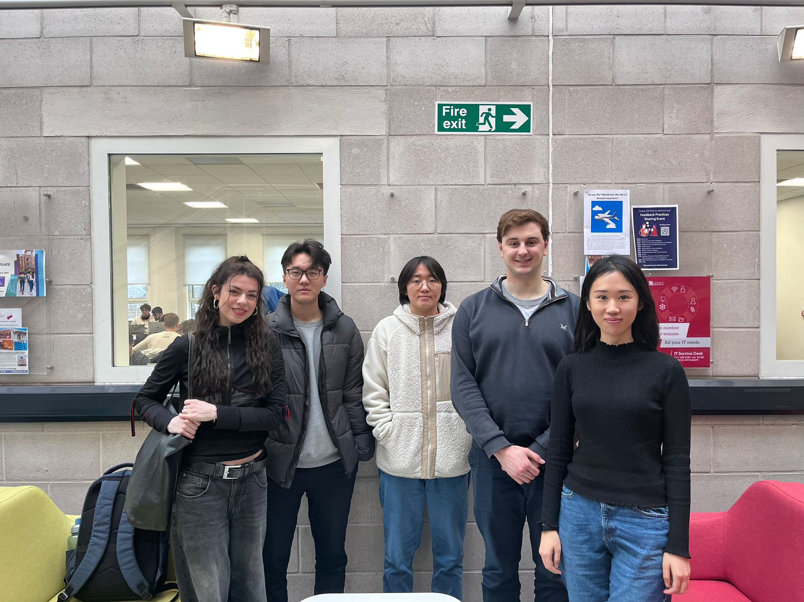
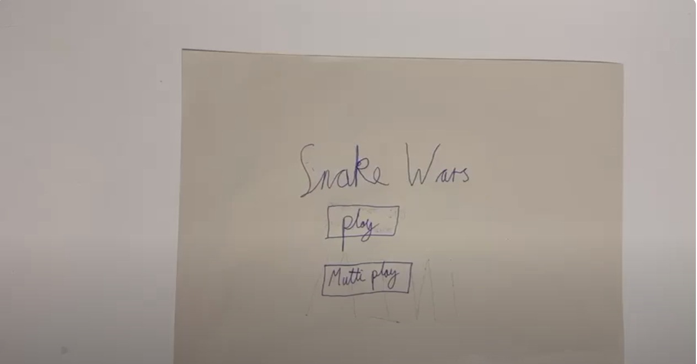
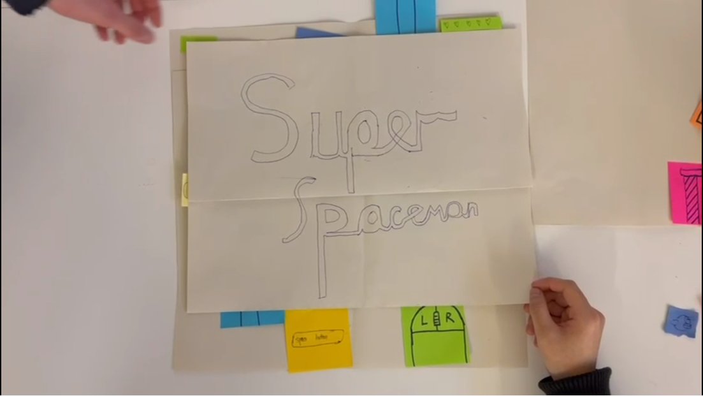
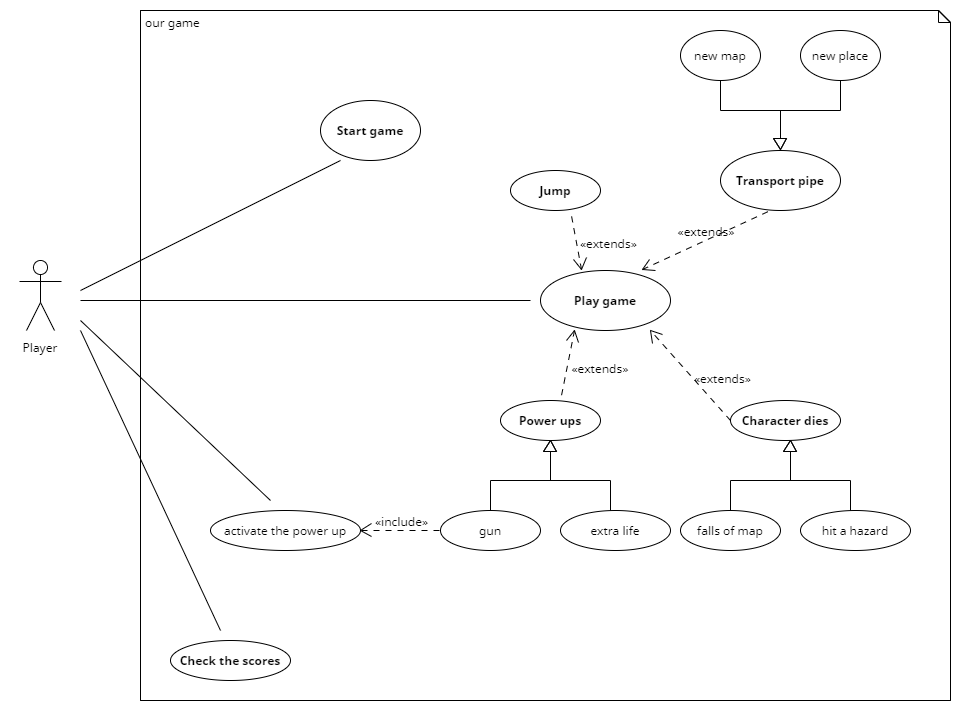

# 2024-group-6

## Table of Contents  

- [Team Photo](#team-photo)
- [Group Members](#group-members)
- [Game Ideas](#game-ideas)
- [Game Features](#game-features)
- [Snake](#snake)
- [Flappy Bird](#flappy-bird)
- [Game Selection](#game-selection---why-we-have-chosen-super-spaceman)
- [Stake Holders](#stake-holders)
- [User Stories](#user-stories)
- [Usecase Specification - General Player](#usecase-specification---general-player)
- [Usecase Specification](#usecase-specification)
- [Usecase - Diagram](#usecase---diagram)
- [Potential Challenges](#potential-challenges)
- [Classes Diagram](#classes-diagram)
- [Think Aloud](#think-aloud)
- [Heuristic Evaluation](#heuristic-evaluation)

## Team Photo

## Group Members

<table>
    <thead>
        <th>Name</th>
        <th>Email</th>
        <th>Git Hub Username</th>
    </thead>
    <tr>
        <td>James Love</td>
        <td>James.Love.2023@bristol.ac.uk</td>
        <td>@JamesLove1</td>
    </tr>
    <tr>
        <td>Cicely Marks</td>
        <td>yb19634@bristol.ac.uk</td>
        <td>@c1c3ly</td>
    </tr>
    <tr>
        <td>Max Cai</td>
        <td>rl23261@bristol.ac.uk</td>
        <td>@sparklefoa1</td>
    </tr>
    <tr>
        <td>Bohan Zhang</td>
        <td>xr23370@bristol.ac.uk</td>
        <td>@zbhbarry</td>
    </tr>
    <tr>
        <td>Qiyue Cao</td>
        <td>oz23134@bristol.ac.uk</td>
        <td>@QQiyyue</td>
    </tr>
</table>

## Game Ideas

Key:
1-9 : Top Options
M: Maybe
N: Removed From List

| Name | URL | Sutibility / Intrest / Ranking|
| -------- | -------- | -------- |
 Snake| <https://en.wikipedia.org/wiki/Snake_(video_game_genre)>   | 1|
| Flappy Bird| <https://en.wikipedia.org/wiki/Flappy_Bird>  | 2a|
| Tetris| <https://en.wikipedia.org/wiki/Tetris>  | 2b |
| Angry Birds| <https://en.wikipedia.org/wiki/Angry_Birds_(video_game)>  | 3 |
| Kingdom Rush| <https://en.wikipedia.org/wiki/Kingdom_Rush>  | M |
| Super Mario| <https://en.wikipedia.org/wiki/Super_Mario_Bros>.  | M |
| Brick Breaker| <https://en.wikipedia.org/wiki/Brick_Breaker>   | M |
| Bejeweled| <https://en.wikipedia.org/wiki/Bejeweled>  | N |
| Zuma| <https://en.wikipedia.org/wiki/Zuma_(video_game)>  | N |
| Deemo| <https://en.wikipedia.org/wiki/Deemo>  | N |

## Game Features

<table>
    <thead>
        <th>Game</th>
        <th>Feature 1</th>
        <th>Feature 2</th>
        <th>Feature 3</th>
    </thead>
    <tbody>
        <tr>
            <td>Snake</td>
            <td>2 Player</td>
            <td>walls</td>
            <td>crash into smaller snakes</td>
        </tr>
        <tr>
            <td>brick braker</td>
            <td>time limit have to break enough bricks to get a particular score</td>
            <td></td>
            <td> </td>
        </tr>
        <tr>
            <td>Flappy Birds</td>
            <td>can go up pipes - leads to new places on the map or a new map entirely</td>
            <td>birds attachement or powers e.g go through a circle and get super power for instance ability to knock thing over </td>
            <td>portals back to start</td>
        </tr>
        <tr>
            <td>Kingdom Rush</td>
            <td>natural disasters(earth quake)</td>
            <td>new attackers/new towers </td>
            <td></td>
        </tr>
        <tr>
            <td>Super Mario Bros</td>
            <td> give mario a plumming truck(with a battering ram)</td>
            <td>seasons of the year () partial sight of the screen </td>
            <td></td>
        </tr>
        <tr>
            <td>Tetris</td>
            <td>new blocks </td>
            <td>exploding blocks </td>
            <td>dynamic screen size </td>
            <td>Miner that deal damage to blocks </td>
        </tr>
        <tr>
            <td>Angry Birds</td>
            <td>different animals e.g. giraffs, elephants and sharks</td>
            <td>water mode (underwater sling shot + above watersling shot) </td>
            <td>change pigs to rats everytime you fail they increase in number</td>
        </tr>
    </tbody>
</table>

## Snake

For snake we have short listed this classic game for many reasons. The top reasons that we picked this game were for its multitude of options and possibilities to be extended with new exciting inovative software devlopment features. As a group, we have highlighted the opportunity to extend Snake with features such as 2 player game play, added walls and eating smaller snakes. Each one of these features will give us, as a group, plenty to work on. The Two Player feature will enable two users on the same machine to play the same game. While adding walls will make it much harder for the snake to move around and access the much needed nutrients need for game play. To offset this we will include smaller snakes to increase the ability for the snake to increase in size.

### Prototype

*Right-click and select "Open link in new tab" to watch the video without leaving GitHub.*

Following creating a prototype for Snake, we quickly found many positives and negative associated though carrying out our development process. This included a change of name, good demonstration and not much in the way of a need to change the core elements of our design. Feedback quickly prompted us to change the name of the game to Snake Wars as the original was too similar to other games out there.  

## Flappy Bird

Choosing Flappy Bird as our inspiration brings a delightful challenge to the table. Our concept introduces several innovative features: Firstly, we can incorporate new patterns that allow players to navigate through pipes to reach new locations or maps. Secondly, we aim to enhance the bird's abilities through unique means, e.g. the ability to shoot lasers. Lastly, we propose adding new gates that redirect players to the starting point, elevating the difficulty level of the game.

### Prototype
<!-- check to see if link works at a latter date https://img.youtube.com/vi/6UDCoNbmHIw/maxresdefault.jpg -->

*Right-click and select "Open link in new tab" to watch the video without leaving GitHub.*

We have ultimately chosen to base our game idea on Flappy Bird and transform it into "Super Spaceman" (the name may be subject to change). As demonstrated in the above prototype, we have introduced three new features: the inclusion of game props, such as heart items to increase lives and a prop gun to destroy debuff effects; alongside these, the addition of negative buffs (such as signs that immediately return the player to the starting point upon collision and signs that alter gravity) constitutes another new feature. The final feature allows players to either access another map through special new channels/portals, or to complete the game by traversing obstacles.

## Game Selection - Why we have chosen Super Spaceman

Although both games hold exciting potential, there was definitely a clear favourite throughout the research process, and the group has collectively agreed to pursue Super Spaceman. Ultimately, Super Spaceman has a greater scope for game features and creative opportunities. For Snake, we could not think of many challenges other than implementing walls, where as, for SSM, we were able to think of multiple categories, including various different hazards and power ups. So much, that we have had to spend time narrowing down which of our ideas to use. When researching these features, we concluded that SSM will also be more complex to implement, therefore providing us a greater chance to apply our knowledge and skills. Similarly, we feel more excited about the interface for SSM, and have already thought of different game maps. Our thoughts were confirmed in Monday’s lab, where we received positive feedback for SSM, and there was a general consensus that this was a more innovative idea and would be the most popular game.

## Stake Holders

<table>
    <thead>
        <tr>
            <th>Stake Holder</td>
            <th>Notes</td>
        </tr>
    </thead>
    <tbody>
        <tr>
            <td>Development Team</td>
            <td>N/A</td>
        </tr>
        <tr>
            <td>Viewers</td>
            <td>People watch live game play e.g. on Youtube, Twitch or over a friends shoulder</td>
        </tr>
        <tr>
            <td>Player - Coursemates</td>
            <td>A player base familiar with the project requirements and can peer review our work.</td>
        </tr>
        <tr>
            <td>Player - General Public</td>
            <td>N/A</td>
        </tr>
        <tr>
            <td>Player - Disabilities(Colour Blind) </td>
            <td>Users with colour blindness should be able to use the app</td>
        </tr>
        <tr>
            <td>Markers</td>
            <td>Looking to play the app to mark our work within 5 mins</td>
        </tr>
    </tbody>
</table>

## User-Stories
>
>"As a Player from General Public I want to play a game based on flappy birds with new innovative features so that it grabs my intrigue and attention."

>"As a member of the Development Team I want to implement a first in class app/game that push me to learn new skills."

>"As a Viewer I want to watch a game to learn by watching players that are more skilled than myself so that I can improve my game play."

>"As a Coursemate playing another groups game, I want to learn off them and become inspired by their vision and implementations of their app/game."

>"As a Player with a disability such as being colour blind I find it very difficult to play some games that dont cater to this. I would like a game which caters to my needs of having different colour contrasts so that i am not impared by my lack vision."

>"As a Marker I want to quickly assess the assignment that I am marking by playing the game within 5 mins."

>"As a Player from the general public, I want to explore different maps/scenarios in the game, so that I can experience freshness and novelty."

>"As a Viewer, I want to see changes in the speed of the game process,  as this is what captures my attention."

## Usecase Specification - General Player

**Description** - Super Spaceman is a game with inspiration taken from the game Flappy Bird. Within the following user specifiction, we are going to take you through a step-by-step routine of which a general player would encounter when playing the game.

**Aim** - The Aim of the game is to prevent Super Spaceman from dying. Throughout the game he encounters many hazards, of which he will have to avoid in order to survive and continue playing. As the user plays the game, Super Spaceman picks up speed.

## Usecase Specification

<table>
    <tbody>
        <tr>
            <td><b>Basic Flow</b></td>
            <td></td>
        </tr>
        <tr>
            <td>1.</td>
            <td>Player uses the the right key on the mouse to make Super Spaceman move up defying gravity. </td>
        </tr>
        <tr>
            <td>2.</td>
            <td>Super Spaceman trys to avoid all hazards.</td>
        </tr>
        <tr>
            <td>3.</td>
            <td>When Super Spaceman eventually hits a hazard, the score is placed on the screen in terms of time.  </td>
        </tr>
    </tbody>
</table>

<b>Alternative Flow:</b>
<table>
    <tbody>
        <tr>
            <td>Steps:</td>
            <td>Pipes</td>
            <td>Power Up's (Invinsibility)</td>
            <td>Hazards (Nuclear Bombs)</td>
        </tr>
        <tr>
            <td>Description:</td>
            <td>Going down pipes transports Super Spaceman to a new map</td>
            <td>Power ups give Super Spaceman extra powers</td>
            <td>When Super Spaceman comes into contact with a Hazard, he dies</td>
        </tr>
        <tr>
            <td>1.</td>
            <td>Player uses the the right key on the mouse to make Super Spaceman move up, defying gravity.</td>
            <td>Player uses the the right key on the mouse to make Super Spaceman move up defying gravity.</td>
            <td>Player uses the the right key on the mouse to make Super Spaceman move up defying gravity.</td>
        </tr>
        <tr>
            <td>2.</td>
            <td>Player guides Super Spaceman into the pipes. Super Spaceman is transported to a new map, or new place on the current map.</td>
            <td>Super Spaceman comes into contact with the Power Up</td>
            <td>Super Spaceman comes into contact with the Hazard</td>
        </tr>
        <tr>
            <td>3.</td>
            <td>Super Spaceman eventually hits a hazard. The score is then placed on the screen in terms of time.</td>
            <td>The Space bar is used to activate the power up.</td>
            <td>When Super Spaceman dies, the score is then placed on the screen in terms of time.</td>
        </tr>
        <tr>
            <td>4.</td>
            <td></td>
            <td>Super Spaceman eventually hits a hazard. The score is then placed on the screen in terms of time.</td>
            <td></td>
        </tr>
    </tbody>
</table>

## Usecase - Diagram

## Reflection

This week, our team gained valuable insights into the specific requirements of our game and we learnt lots about different player experiences. The task highlighted just how important it is to consider all potential players, as well as clearly understanding every player’s needs. We discussed specific ways to ensure that our game resonates with many. For example, including exciting and sophisticated features, whilst also being adaptable to those with disabilities. As a team, we enjoyed the process of collaborating and coming to these decisions, and due to our effective planning, we were able to produce a user story and use case that matched and reflected our initial game requirements.

However, when discussing our use case specification and creating our use case diagram, we realised that our initial plan was perhaps over complicated. We had some slight issues when defining whether something was an ‘include’ or ‘extend’. Some of our members were unable to meet in person, and so when we came together to discuss our use case diagram, it was difficult to explain over the phone, specific things that we wanted them to change and why. This meant that we had to refactor lots, which overall emphasised the importance of remaining flexible throughout the game design process. Ultimately, this task was an important learning journey that provided us with a solid game design that we think will be open to many.

## Potential Challenges

Based on Flappy Bird, but the player can transport to different maps.

- Challenge 1 - Entering transport pipes -
- Challenge 2 - Data structure for storing the map - and changing it when they exit the portal pipes
- Challenge 3 - How to decide if the player enters a new map, or just a different location on the current map. (the control flow)
- Challenge 4 - Deciding where you go on the current map.

Extra notes:

- Generating the code for randomised hazards
- Implementing losing health when the player hits a hazards

## Classes Diagram

# Qualitative Evaluation

Too collect Qualitative data for our game we will use two methords namly the Think Aloud and Heuristic Evaluation methords. This should provide us with the relevant with and depth of data to gain meaningful insights.  

## Think Aloud

Feedback 1 - game character movements, found issues in the sense that the character dies and also goes off the screen.  

Feedback 2 - pipes creation, need to create pipes.  

Feedback 3 - The pipes only generates randomly within the first three pairs internally, then simply repeats them continuously, resulting in only three distinct pairs of pipes indefinitely.

Feedback 4 - It would be easier to use the spacebar to control the character.

## Heuristic Evaluation

<table>
    <tbody>
        <tr>
            <td><b>Interface</b></td>
            <td><b>Issue</b></td>
            <td><b>Heuristic(s)</b></td>
            <td><b>Frequency</b> 0 (rare) to 4 (common)</td>
            <td><b>Impact</b> 0 (easy) to difficult (4)</td>
            <td><b>Persistence</b> 0 (once) to 4 (repeated)</td>
            <td><b>Severity</b> = Sum Total of F+I+P/3</td>
        </tr>
        <tr>
            <td>Pipes</td>
            <td>pay attention to the spacing between the pipes(at least could be able to see the next pipe when passing through this pipe)</td>
            <td>Aesthetic and Minimalist Design</td>
            <td>4</td>
            <td>1</td>
            <td>4</td>
            <td>3</td>
        </tr>
        <tr>
            <td>Character</td>
            <td>Need bigger jumps(need to click many times to jump higher)</td>
            <td>Consistency and Standards</td>
            <td>4</td>
            <td>0</td>
            <td>0</td>
            <td>4</td>
        </tr>
        <tr>
            <td>Gravity</td>
            <td>Fall too slowly. Character need more Gravity</td>
            <td>Consistency and Standards</td>
            <td>0</td>
            <td>0</td>
            <td>0</td>
            <td>0</td>
        </tr>
        <tr>
            <td>Movements</td>
            <td>Gameplay judgments are a bit sketchy, the distances of pipes are a bit large. Reset the judgments of collision, narrowing the distances of pipes</td>
            <td>Consistency and Standards</td>
            <td>4</td>
            <td>2</td>
            <td>4</td>
            <td>3</td>
        </tr>
    </tbody>
</table>

## Summary - Qualative Evaluation

The Heuristic Evaluation bought important issues about our game, to our attention. The issues primarily related to Consistency and Standards, but also the Aesthetic and Design of our game. The most severe issue related to our character interface. We found that the user needs to click many times to make the character jump higher, leading to a frustrating gameplay. This was a common issue, scoring 4/4 and led to a sum total of 4/4. We have decided to modify the character slightly, and increase the height of the jump per click. We have also decided to increase the gravity rate. This is because we found that the character fell too slowly, making it difficult to progress further through the game.

We noted issues relating to the Movements and Pipes interfaces of our game. This included the distances between pipes being too large, the pipes not generating randomly and the character falling off the screen. Although the issues individually are relatively minor, accumulated together they are noticeably persistent and severe (3/4), and overall leads to a rather ‘sketchy’ gameplay. Therefore, we have decided to reset the judgements of collision, narrow the distance between pipes and ensure that the pipes pattern does not continuously repeat. This not only improves the Consistency and Standards usability, but also the Aesthetic and Minimalist Design usability.

# Quantitavie Evaluation

In this section we will analysie and showcase collected data from participants who have played our game. We selected the NASA TLXs and System Unability Survey(SUS) to do this.

## NASA TLXs Questionair

<table>
    <thead>
        <th>Participant(Names Hidden for Privacy)</th>
        <th>Mental Demand</th>
        <th>Physical Demand</th>
        <th>Temporal Demand</th>
        <th>Performance</th>
        <th>Effort</th>
        <th>Frustration</th>
        <th>RAW Nasa TLX Scour</th>
    </thead>
    <tbody>
        <tr>
            <td>1</td>
            <td>5</td>
            <td>3</td>
            <td>3</td>
            <td>0</td>
            <td>5</td>
            <td>5</td>
            <td>3.5</td>
        </tr>
        <tr>
            <td>2</td>
            <td>1</td>
            <td>2</td>
            <td>16</td>
            <td>20</td>
            <td>1</td>
            <td>2</td>
            <td>8</td>
        </tr>
        <tr>
            <td>3</td>
            <td>3</td>
            <td>3</td>
            <td>5</td>
            <td>6</td>
            <td>3</td>
            <td>7</td>
            <td>4.5</td>
        </tr>
        <tr>
            <td>4</td>
            <td>5</td>
            <td>5</td>
            <td>5</td>
            <td>0</td>
            <td>3</td>
            <td>2</td>
            <td>3.33</td>
        </tr>
        <tr>
            <td>5</td>
            <td>1</td>
            <td>1</td>
            <td>1</td>
            <td>0</td>
            <td>1</td>
            <td>1</td>
            <td>0.83</td>
        </tr>
    </tbody>
</table>

## System Unability Survey(SUS)

Scale:  
1 == Strongly Disagree,   
5 == Strongly Agree      

<table>
    <thead>
        <td>Participant(Names Hidden for Privacy)</td>
        <th>6</th>
        <th>7</th>
        <th>8</th>
        <th>9</th>
        <th>10</th>
    </thead>
    <tbody>
        <tr>
            <td>I think that I would like to use this system frequently</td>
            <td>4</td>
            <td>4</td>
            <td>3</td>
            <td>5</td>
            <td>3</td>
        </tr>
        <tr>
            <td>I found the system unnecessarily complex</td>
            <td>1</td>
            <td>1</td>
            <td>1</td>
            <td>1</td>
            <td>1</td>
        </tr>
        <tr>
            <td>I thought the system was easy to use</td>
            <td>5</td>
            <td>5</td>
            <td>5</td>
            <td>5</td>
            <td>5</td>
        </tr>
        <tr>
            <td>I think that I would need the support of a technical person to be able to use this system.</td>
            <td>1</td>
            <td>1</td>
            <td>4</td>
            <td>1</td>
            <td>1</td>
        </tr>
        <tr>
            <td>I found the various functions in the system were well integrated</td>
            <td>4</td>
            <td>4</td>
            <td>2</td>
            <td>5</td>
            <td>1</td>
        </tr>
        <tr>
            <td>I though there was too much inconsistency in this system</td>
            <td>1</td>
            <td>1</td>
            <td>2</td>
            <td>2</td>
            <td>1</td>
        </tr>
        <tr>
            <td>I would imagine that most people would learn to use this system very quickly</td>
            <td>5</td>
            <td>5</td>
            <td>4</td>
            <td>5</td>
            <td>5</td>
        </tr>
        <tr>
            <td>I found the system very cumbersome to use</td>
            <td>1</td>
            <td>1</td>
            <td>2</td>
            <td>1</td>
            <td>1</td>
        </tr>
            <td>I felt very confident using the system</td>
            <td>5</td>
            <td>5</td>
            <td>3</td>
            <td>3</td>
            <td>5</td>
        <tr>
        </tr>
            <td>I needed to learn a lot of things before I could get going with this system</td>
            <td>2</td>
            <td>1</td>
            <td>2</td>
            <td>1</td>
            <td>1</td>
        </tr>
    </tbody>
</table>

## Summary - Quantitative Evaluation

"Summary of data - Cecily??"

# Sprint 1

## Improvments:

> SUS - "I found the system unnecessarily complex", when the results were analysed we found this quesition inparticularly scored low. To improve this scoure we embarked on a program too add a splash screen and a you have died screen that returns users to the splash screen. We have designed it as such that the user much click the screen to go back to the start screen as prior to this we allowed it to be done with keys though the user would hold down the keys and would end up in a sudo infinate loop senario untill the key was lifter. 

> Make improvments to the collisions. The character before we made the changes would not die if it hit the top or bottom of the screen. We added collision to detect this and now the character does indeed die upone such impact with the top and bottom of the screen. 

> Increased the amount of "G-force" applyed to the character so that it falls quicker. At present the character falls too slowley. This means that by no falt of the user the character colides into obsticals(mainly pipes) as the character does not fall quicker enough. We changed this so that now the character does fall much quicker. To ofset this we have also had to increase the deltaY which is used to move the character up upone jumping. 

# Group notes

<https://processing.org/tutorials>

## Mark Scheem

Project Report

1. Team

Who’s in your team + team photo.

2. Introduction (5% ~250 words)

Describe your game, what is based on, what makes it novel?

3. Requirements (15% ~750 words)

Use case diagrams, user stories. Early stages design. Ideation process. How did you decide as a team what to develop?

4. Design (15% ~750 words)

System architecture. Class diagrams, behavioural diagrams.

5. Implementation (15% ~750 words)

Describe implementation of your game, in particular highlighting the three areas of challenge in developing your game.

6. Evaluation (15% ~750 words)

One qualitative evaluation (your choice)

One quantitative evaluation (of your choice)

Description of how code was tested.

7. Process (15% ~750 words)

Teamwork. How did you work together, what tools did you use. Did you have team roles? Reflection on how you worked together.

8. Conclusion (10% ~500 words)

Reflect on project as a whole. Lessons learned. Reflect on challenges. Future work.

· Quality of report writing, presentation, use of figures and visual material (5%)

· Documentation of code (5%)

· Individual contribution. Provide a table of everyone's contribution, which may be used to weight individual grades. We expect that the contribution will be split evenly across team-members in most cases. Let us know as soon as possible if there are any issues with teamwork as soon as they are apparent.
